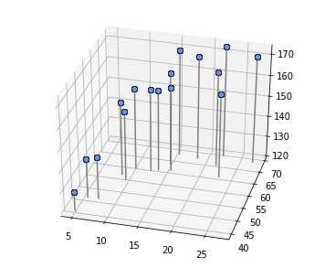
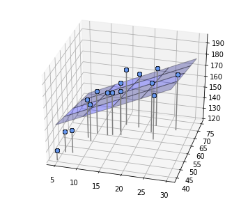
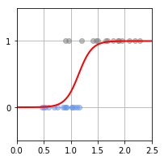

# 教師あり機械学習：回帰の応用

## 準備

タプル


```python
a = (1,3,5)
print(a)
```

    (1, 3, 5)


タプルを返却する関数


```python
def hoge():
    return 2,4,6

a,b,c = hoge()

print(a)
print(b)
print(c)
```

    2
    4
    6


## 1次元入力モデルの改良版


前回のプログラムは重みをw0,w1と２つの変数を用いて表現していた。
今回のプログラムでは、より一般化するために重み配列Wを用いる

W[0] が w0 を、W[1] が w1 を表す

## 演習8-1プログラムを完成させよ


```python
# -*- coding: utf-8 -*-
import numpy as np


# データを生成して、返却する
def load_data(seed=1):
    np.random.seed(seed)
    X_n = 16
    X = 5 + 25 * np.random.rand(X_n)
    Prm_c = [170,108,0.2]
    T = Prm_c[0] - Prm_c[1] * np.exp(-Prm_c[2] * X) + 4 * np.random.randn(X_n)
    return X,T

# 誤差関数の偏微分
def dmse_line(X,T,W):
    ★ココを記述する★


# 勾配法
def fit_line_num(X,T,w_init):
    alpha = 0.001 #学習率。どれくらいちょっとづつ探索するか
    eps = 0.1     #学習の繰り返しをやめる閾値
    w_i = w_init  #探索を開始する初期値
    for i in range(1,1000000):
        # 偏微分して勾配を求める
        dmse = dmse_line(X,T,w_i)
        # 勾配のほうにちょっと動く
        ★ココを記述する★
        # 傾きの絶対値の最大値が、しきい値より小さい場合は、終了する
        if max(np.absolute(dmse)) < eps:
            break
    return w_i

# データロード
X,T = load_data()

# 勾配法により、Wを求める
W_init = [10.0,165.0]
W = fit_line_num(X,T,W_init)

print("求めたモデルは t={0} * x + {1}".format(W[0],W[1]))

```

    求めたモデルは t=1.5399473562672923 * x + 136.1761603274906


## 2次元入力モデル

### データをロードして表示する


```python
# -*- coding: utf-8 -*-
import numpy as np

# データを図示する
def show_data2(x0,x1,t):
    import matplotlib.pyplot as plt
    from mpl_toolkits.mplot3d import Axes3D
    plt.figure(figsize=(6,5))
    ax = plt.subplot(1,1,1,projection='3d')
    for i in range(len(x0)):
        ax.plot([x0[i],x0[i]],[x1[i],x1[i]],[120,t[i]],color='gray')
        ax.plot(x0,x1,t,'o',color='cornflowerblue',markeredgecolor='black',markersize=6,markeredgewidth=0.5)
        ax.view_init(elev=35,azim=-75)
    plt.show()

# データと平面を図示する
def show_data2_and_plane(x0,x1,t,w0,w1,w2):
    import matplotlib.pyplot as plt
    from mpl_toolkits.mplot3d import Axes3D
    X0_min = 5
    X0_max = 30
    X1_min = 40
    X1_max = 75
    plt.figure(figsize=(6,5))
    ax = plt.subplot(1,1,1,projection='3d')
    for i in range(len(x0)):
        ax.plot([x0[i],x0[i]],[x1[i],x1[i]],[120,t[i]],color='gray')
        ax.plot(x0,x1,t,'o',color='cornflowerblue',markeredgecolor='black',markersize=6,markeredgewidth=0.5)
        ax.view_init(elev=35,azim=-75)
    px0 = np.linspace(X0_min,X0_max,5)
    px1 = np.linspace(X1_min,X1_max,5)
    px0,px1 = np.meshgrid(px0,px1)
    y = w0*px0 + w1*px1 + w2
    ax.plot_surface(px0,px1,y,rstride=1,cstride=1,alpha=0.3,color='blue',edgecolor='black')
    plt.show()

# データをロードする
def load_data2(seed=1):
    np.random.seed(seed)
    X_n = 16
    X = 5 + 25 * np.random.rand(X_n)
    Prm_c = [170,108,0.2]
    T = Prm_c[0] - Prm_c[1] * np.exp(-Prm_c[2] * X) + 4 * np.random.randn(X_n)    
    X0 = X
    X1 = 23 * (T/100)**2 + 2 * np.random.random(X_n)
    return X0,X1,T

# データのロードと表示
X0,X1,T = load_data2()
show_data2(X0,X1,T)
```





## プログラムを完成させよ


```python
# 平均誤差関数の偏微分
def dmse_plane(X0,X1,T,W):
   ★ココを記載する★


#　勾配法
def fit_plane_num(X0,X1,T,w_init):
    alpha = 0.000025  #学習率。どれくらいちょっとづつ探索するか
    eps = 2.0         #学習の繰り返しをやめる閾値
    w_i = w_init      #探索を開始する初期値
    for i in range(1,1000000):
        # 偏微分して勾配を求める
        dmse = dmse_plane(X0,X1,T,w_i)
        # 勾配のほうにちょっと動く
        ★ココを記載する★
        if max(np.absolute(dmse)) < eps:
            break
    return w_i


# 勾配法
w_init = [10.0, 44.0,165,0]
W = fit_plane_num(X0,X1,T,w_init)

# 結果の表示
print("求めたモデルは t={0} * x1 + {1} * x2 + {2}".format(W[0],W[1],W[2]))
show_data2_and_plane(X0,X1,T,W[0],W[1],W[2])


```


    求めたモデルは t=1.7473074466957874 * x1 + -0.5077986138729385 * x2 + 163.96463740131395





# 教師あり機械学習：分類

## データロード

```python
# -*- coding: utf-8 -*-
import numpy as np

# データの描画
def show_data(x,t):
    import matplotlib.pyplot as plt
    X_min = 0
    X_max = 2.5
    plt.figure(figsize=(3,3))
    X_col = ['cornflowerblue','gray']
    K = np.max(t) + 1
    for k in range(K):
        plt.plot(x[t==k], t[t==k], X_col[k], alpha=0.5,linestyle='none',marker='o')
    plt.grid(True)
    plt.ylim(-.5, 1.5)
    plt.xlim(X_min, X_max)
    plt.yticks([0,1])
    plt.show()

# データとモデルの描画
def show_data_and_sigmoid(x,t,w):
    import matplotlib.pyplot as plt
    X_min = 0
    X_max = 2.5
    plt.figure(figsize=(3,3))
    X_col = ['cornflowerblue','gray']
    K = np.max(t) + 1
    for k in range(K):
        plt.plot(x[t==k], t[t==k], X_col[k], alpha=0.5,linestyle='none',marker='o')
    plt.grid(True)
    plt.ylim(-.5, 1.5)
    plt.xlim(X_min, X_max)
    plt.yticks([0,1])
    xb = np.linspace(0,2.5,100)
    y = logistic(xb,w)
    plt.plot(xb,y,color='red',linewidth=2)
    plt.show()


# データのロード
def load_data():
    X_n = 30
    np.random.seed( seed = 0) #乱数 を 固定
    X = np.zeros(X_n)
    T = np.zeros(X_n, dtype=np.uint8)
    Dist_s = [0.4, 0.8]
    Dist_w = [0.8, 1.6]
    Pi = 0.5
    for n in range(X_n):
        wk = np.random.rand()
        T[n] = 0 * (wk < Pi) + 1 * (wk > Pi)
        X[n] = np.random.rand() * Dist_w[T[n]] + Dist_s[T[n]]
    return X,T


# データのロード
X,T = load_data()

# データの表示
show_data(X,T)
print(X)
print(T)

```


    [1.94430299 1.67181309 0.91671529 1.1134184  1.41350643 1.64623187
     2.28095462 0.46970344 1.06609588 2.19201944 2.0786537  1.02442334
     0.91193682 1.15573513 1.4634591  1.01938695 0.85474716 0.8941084
     1.78709439 1.89091248 0.74962556 0.89636075 1.87302059 0.50314104
     0.69096862 1.50176242 0.9632717  0.52904761 1.20526656 0.59554047]
    [1 1 0 0 1 1 1 0 0 1 1 0 0 0 1 0 0 0 1 1 0 1 1 0 0 1 1 0 1 0]


## 平均交差エントロピー誤差の計算


```python
# ログスティック回帰モデル
def logistic(x,w):
    y = 1/(1 + np.exp(-(w[0] * x + w[1])) )
    return y

# 平均交差エントロピー誤差
def cee_logistic(w,x,t):
    y = logistic(x,w)
    return - np.mean(t * np.log(y) + (1-t) * np.log(1-y))

print(cee_logistic([1,1],X,T))
```

    1.0288191541851066


## 平均交差エントロピー誤差の微分

```python
# 平均交差エントロピー誤差の微分
def dcee_logistic(w,x,t):
    y = logistic(x,w)
    d_W = np.zeros(2)
    d_W[0] = np.mean((y-t)*x)
    d_W[1] = np.mean(y-t)
    return d_W

print(dcee_logistic([1,1],X,T))
```

## 勾配法による解

```python
#　今回は科学技術計算ライブラリscipyを利用する
import scipy.optimize

W_init = [1,-1]
result = scipy.optimize.minimize(cee_logistic,W_init,args=(X,T),jac=dcee_logistic,method="CG")

# 結果表示
W=result.x
show_data_and_sigmoid(X,T,W)
print("--result-------")
print(result)
print("----------------")
print("求めたモデルは1/(1 + np.exp(-({0} * x + w{1})) )".format(W[0],W[1]))

```

    [0.30857905 0.39485474]





    --result-------
         fun: 0.25104463379423897
         jac: array([ 4.28508972e-06, -1.59777280e-07])
     message: 'Optimization terminated successfully.'
        nfev: 36
         nit: 12
        njev: 36
      status: 0
     success: True
           x: array([ 8.17647664, -9.3822462 ])
    ----------------
    求めたモデルは1/(1 + np.exp(-(8.176476643963325 * x + w-9.38224620184623)) )

